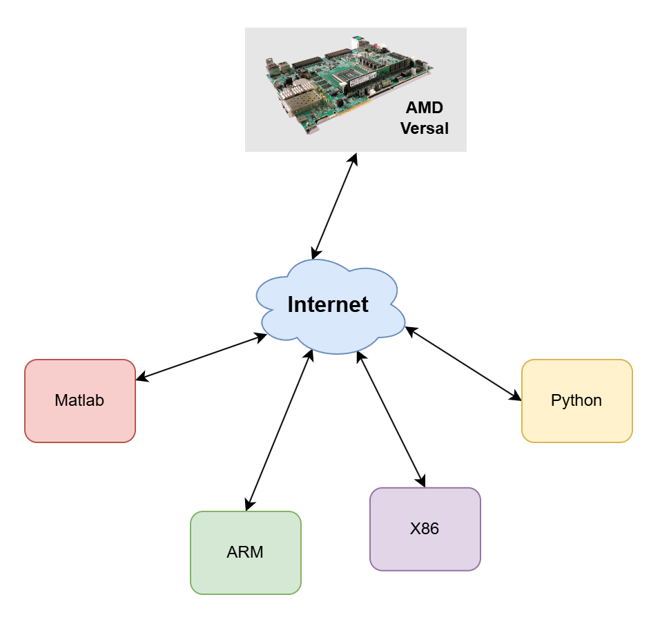

# AI Engine Test Harness

## Introduction

AIE (AI Engine) Test Harness is designed to assist AIE application designers in verifying and benchmarking
their designs on the **Versal** platforms such as the VCK190, with the ease of a software simulator.
Most importantly, AIE Test Harness allows the developers to conduct testing across diverse host systems, including **x86** and **ARM**, 
from various development environments like **Matlab** and **Python**. 



## Features
### AIE Test Harness Virtualization
The virtualization feature of the test harness offers AIE designers a seamless and efficient testing experience by abstracting away the complexities of network communications and hardware specifics, such as device controls. 
This feature allows designers to focus entirely on their AIE designs without needing to interact directly with the underlying hardware. 
By leveraging the client APIs available in C++, Python, and MATLAB, designers can create testbenches that operate entirely on local hosts. 
This setup ensures that all interactions with the test harness server are handled virtually, eliminating the need for manual data exchanges or server modifications during testing. 
As a result, the virtualization feature streamlines the testing process, making it more accessible and less time-consuming for developers.

#### Test Harness Server
The server application, included with the repository, 
runs continuously on the Versal board and accepts connections from multiple clients on a first-come, first-served basis.
Once a connection is established, the server processes client requests to perform a series of actions for testing. 
These actions include initializing the device with AIE designs provided by the clients, 
running the AIE graphs and DMA with client-supplied data, and waiting for transactions to complete 
before sending the results back to the clients. 
If required, the server can also dump AIE event traces and transmit them to the clients. 
After completing these tasks, the server cleans all user data and resets the board, 
ensuring a fresh start for subsequent testing sessions.

#### Test Harness Client APIs
With the test harness, AIE designers can focus solely on their designs without worrying about network communications or hardware details, such as device controls. 
The testbench is created using the test harness client APIs, which are available in C++, Python, or MATLAB. 
These APIs empower designers to efficiently manage the testing process by allowing them to connect to the server, 
load the AIE design, and run tests in transactions. 
Designers can also wait for transactions to complete or set a timeout, measure performance, verify functionalities, and request AIE event traces. 
Additionally, the APIs provide the capability to disconnect from and reset the board, ensuring a streamlined and user-friendly testing experience.

### Testing Mode
There are two useful testing modes named function mode and performance mode. 
#### Function mode
In the function mode, it aims to verify the functionalities of the AIE design on the hardware with a large datasets provided by the users. 
In this mode, all user-provided data are transferred between the DDR and the AIE with a proper buffering.
In the this mode, stalls may be introduced due to the bandwidth limitation when accessing DDR. 
Hence, the measured performance is not representative of the maximum potential throughput of the graph.

#### Performance Mode
In the performance mode, the DMA engine for performance testing is designed to allow a maximum throughput on the PLIO interfaces, ensuring that the data transfer between AIE and PL isn’t artificially stalled by the DMA channels and thereby allowing accurate performance testing on the hardware.

### Precompiled XSA
The precompiled XSA is provided along with the release of this repository, and is used as a platform on which the designers compile the AIE graph.
The major component of the XSA is the DMA designed on the PL, which feeds data to AIE application or fetch data from AIE application via AXI-streams. 
It allows the users to skip the time-consuming `v++` link stage and directly go to `v++` package stage to generate the final `.xclbin` file for on-board tests.

- On the Vck190 platform, the PL DMA consists of 72 channels, 36 of them feed data to AIE and the rest 36 fetch data from AIE.
Each channel contains its own URAM buffer which is 128bits x 4096 and its own AXI-stream port for input or output.
- On the Vek280 platform, the PL DMA consists of 32 channels, 16 for the AIE inputs and 16 for the AIE outputs. Similarly, each channel contains a URAM buffer of 128bits x 8192. 


## Setup
Using the following commands to downloads the SD card image and the precompiled `xsa` for each supported board under `${TEST_HARNESS_REPO_PATH}/bin/`.
```
# under the repository path, run
./setup.sh
```

### Setup the server
The Versal board requires a simple one-time setup by flashing the SD card with the provided image, booting the board from the SD card, and launching the test harness server application.

### Using Test Harness for Testing
The repository includes multiple examples to help you learn how to use the test harness for testing AIE graph designs.
The designers only need to prepare the following three items for each test:
- AIE designs to be tested.
- Testing vectors.
- Testbenches utilizing the test harness client APIs.

#### AIE Graph Example
``` C++

// graph.h
class test_graph : public graph {
   private:
    kernel adder;

   public:
    input_plio pl_in0, pl_in1;
    output_plio pl_out;

    test_graph() {
        adder = kernel::create(aie_adder);

        // REQUIRED: Declare PLIOs using one of the predefined names, and using the predefined width of 128 bits
        pl_in0 = input_plio::create("PLIO_01_TO_AIE", adf::plio_128_bits, "data/DataIn0.txt");
        pl_in1 = input_plio::create("PLIO_03_TO_AIE", adf::plio_128_bits, "data/DataIn1.txt");
        pl_out = output_plio::create("PLIO_02_FROM_AIE", adf::plio_128_bits, "data/DataOut0.txt");

        connect<stream> net0(pl_in0.out[0], adder.in[0]);
        connect<stream> net1(pl_in1.out[0], adder.in[1]);
        connect<stream> net2(adder.out[0], pl_out.in[0]);

        source(adder) = "adder.cc";

        runtime<ratio>(adder) = 1;
    };
};
```

#### Testbench Example

``` python
# example of the client testbench for an adder implemented on the AIE

def main(args):
    # size of the test vector
    num_values = 65536 * args.iterations
    # first random inputs for an adder
    a = np.random.randint(-65536, 65536, num_values, dtype=np.int32)
    # second random inputs for an adder
    b = np.random.randint(-65536, 65536, num_values, dtype=np.int32)

    # path to the xclbin package of the AIE design
    xclbin_path = args.xclbin                                           
    
    # create test harness client manager, which instructs the server to initialize the device, and load the design to be tested
    mgr = test_harness_mgr(xclbin_path, ['gr'], 'vck190')               
    test_modes = [test_mode.FUNC_MODE, test_mode.PERF_MODE]

    for mode in test_modes:
        # prepare memory for the result of each transaction
        res = np.zeros(num_values, dtype=np.int32)
        
        # prepare argument lists to the test harness
        targs = list()
        # array 'a' feeds to the "PLIO_01_TO_AIE"
        targs.append(test_harness_args(channel_index.PLIO_01_TO_AIE, num_values * 4, 1, 1, a))
        # array 'a' feeds to the "PLIO_03_TO_AIE"
        targs.append(test_harness_args(channel_index.PLIO_03_TO_AIE, num_values * 4, 1, 1, b))
        # array 'res' gets the data from the "PLIO_02_TO_AIE"
        targs.append(test_harness_args(channel_index.PLIO_02_FROM_AIE, num_values * 4, 1, 1, res))

        # run the AIE graph
        mgr.runAIEGraph(0, args.iterations)
        # run the DMA engine with the arguments
        mgr.runTestHarness(mode, targs)
        # wait for the results coming back, data will be valid in the 'res'
        mgr.waitForRes()
        # print the performance
        mgr.printPerf()
        # result verification
        ...
```

## Examples
Following are examples that provided for your references:

| Example                                                 | Language | Board  | External Reference                                                                                                 |
|---------------------------------------------------------|----------|--------|----------------------------------------------------------------------------------------------------------------------|
| [adder_perf](examples/vck190/adder_perf/)               | C++      | vck190 |                                                                                                                      |
| [channelizer](examples/vck190/channelizer/)             | C++      | vck190 | [Channelizer Tutorial](https://github.com/Xilinx/Vitis-Tutorials/tree/2024.2/AI_Engine_Development/AIE/Design_Tutorials/04-Polyphase-Channelizer) |
| [testcase_dmafifo_opt](examples/vck190/testcase_dmafifo_opt/) | C++      | vck190 | [AIE Performance Tutorial](https://github.com/Xilinx/Vitis-Tutorials/tree/2024.2/AI_Engine_Development/AIE/Feature_Tutorials/13-aie-performance-analysis) |
| [adder_perf](examples/vek280/adder_perf/)               | C++      | vek280 |                                                                                                                      |
| [normalization_v2](examples/vek280/normalization_v2/)   | C++      | vek280 | [AIE-ML Performance Tutorial](https://github.com/Xilinx/Vitis-Tutorials/tree/2024.2/AI_Engine_Development/AIE-ML/Feature_Tutorials/13-aie-ml-performance-analysis) |
| [adder](examples/matlab/vck190/adder/)                  | MATLAB   | vck190 |                                                                                                                      |
| [adder](examples/python/vck190/adder/)                  | Python   | vck190 |                                                                                                                      |

Note: The examples may not be updated to the newest as the external reference.

## License

MIT License

Copyright (C) 2023-2025 Advanced Micro Devices, Inc.

Permission is hereby granted, free of charge, to any person obtaining a copy of this software and associated documentation files (the “Software”), to deal in the Software without restriction, including without limitation the rights to use, copy, modify, merge, publish, distribute, sublicense, and/or sell copies of the Software, and to permit persons to whom the Software is furnished to do so, subject to the following conditions:

The above copyright notice and this permission notice shall be included in all copies or substantial portions of the Software.

THE SOFTWARE IS PROVIDED “AS IS”, WITHOUT WARRANTY OF ANY KIND, EXPRESS OR IMPLIED, INCLUDING BUT NOT LIMITED TO THE WARRANTIES OF MERCHANTABILITY, FITNESS FOR A PARTICULAR PURPOSE AND NONINFRINGEMENT. IN NO EVENT SHALL THE AUTHORS OR COPYRIGHT HOLDERS BE LIABLE FOR ANY CLAIM, DAMAGES OR OTHER LIABILITY, WHETHER IN AN ACTION OF CONTRACT, TORT OR OTHERWISE, ARISING FROM, OUT OF OR IN CONNECTION WITH THE SOFTWARE OR THE USE OR OTHER DEALINGS IN THE SOFTWARE.

Except as contained in this notice, the name of Advanced Micro Devices, Inc. shall not be used in advertising or otherwise to promote the sale, use or other dealings in this Software without prior written authorization from Advanced Micro Devices, Inc.
