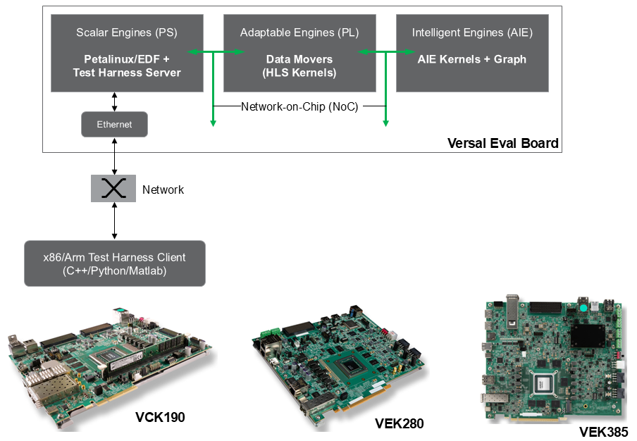

<table width="100%">
 <tr width="100%">
    <td align="center"><h1>AMD Vitis™ AI Engine Test Harness</h1>
    </td>
 </tr>
</table>

## Introduction

AIE (AI Engine) Test Harness is designed to assist AIE application designers in verifying and benchmarking
their designs on the **Versal** platforms such as the VCK190, VEK280, and VEK385, with the ease of a software simulator.
Most importantly, AIE Test Harness allows the developers to conduct testing across diverse host systems, including **x86** and **ARM**, 
from various development environments like **Matlab** and **Python**. 



## Features
### AIE Test Harness Virtualization

The virtualization feature abstracts hardware complexity, allowing designers to focus on AIE designs:

**Key Benefits:**
- **Hardware abstraction** - No need to interact directly with device controls or network details
- **Local development** - Create testbenches entirely on local hosts (x86/ARM)
- **Multi-language support** - Available in C++, Python, and MATLAB
- **Automated handling** - Virtual server interactions eliminate manual data exchanges
- **Streamlined workflow** - Reduces time and complexity in testing process

#### Test Harness Server

The server application runs continuously on the Versal board and manages client connections:

**Connection Model:**
- Accepts multiple client connections on **port 8080**
- **First-come, first-served** basis

**Workflow per Client:**
1. **Initialize** - Load AIE design provided by client
2. **Execute** - Run AIE graphs and DMA with client-supplied data
3. **Wait** - Transaction completion monitoring
4. **Return** - Send results back to client
5. **Trace** (optional) - Dump and transmit AIE event traces
6. **Reset** - Clean all user data and reset board for next session

#### Test Harness Client APIs

Client APIs (C++, Python, MATLAB) enable designers to focus on AIE designs without hardware concerns.

**Available Operations:**
- **Connection management** - Connect to/disconnect from server
- **Design loading** - Load AIE design onto device
- **Transaction control** - Run tests and wait for completion (with optional timeout)
- **Performance measurement** - Measure and report throughput/latency
- **Functional verification** - Verify design correctness
- **Debug support** - Request AIE event traces
- **Device control** - Reset board between tests

### Testing Modes

There are two useful testing modes: functional testing mode and performance testing mode.

#### Functional Testing Mode
- **Purpose:** Verify functional correctness of the implementation on hardware with large datasets
- **Data Source:** DDR memory with proper buffering
- **Stalls:** May occur due to DDR bandwidth limitation
- **Performance Measurement:** Not representative of maximum potential throughput
- **Results:** Always valid
- **Use Case:** Correctness verification with large datasets

#### Performance Testing Mode
- **Purpose:** Measure maximum throughput on PLIO interfaces
- **Data Source:** URAM buffers for direct access
- **Stalls:** Minimized - ensures data transfer between AIE and PL isn't artificially stalled
- **Performance Measurement:** Accurate max throughput measurement
- **Results:** Valid only if data fits in URAM buffer
- **Use Case:** Accurate hardware benchmarking

### Precompiled XSA

The precompiled XSA is provided with each release and serves as the platform for compiling AIE graphs.

**Key Benefits:**
- **Skip v++ link stage** - Eliminates time-consuming PL implementation (saves hours)
- **Pre-built DMA** - Ready-to-use PL DMA for data transfer via AXI-streams
- **Fast iteration** - Directly package to `.xclbin` for on-board testing

**Platform Specifications:**

| **Platform** | **Total Channels** | **Input Channels** | **Output Channels** | **URAM Buffer per Channel** |
|--------------|-------------------:|-------------------:|--------------------:|----------------------------:|
| VCK190       | 72                 | 36                 | 36                  | 128-bit × 4096              |
| VEK280       | 32                 | 16                 | 16                  | 128-bit × 8192              |
| VEK385       | 32                 | 16                 | 16                  | 128-bit × 8192              |

**Note:** Each channel includes its own URAM buffer and dedicated AXI-stream port. 


## Setup

### Step 1: Download Precompiled Assets

Download the SD card image and precompiled XSA for all supported boards:

```bash
# Run from repository root
./setup.sh
```

**Downloads to:** `${TEST_HARNESS_REPO_PATH}/bin/`
- SD card images for VCK190, VEK280
- Server application for VEK385 (`vek385_server.zip`)
- Precompiled XSA files for each platform (VCK190, VEK280, VEK385)

### Step 2: Setup the Server (One-time)

**For VCK190 and VEK280 (PetaLinux-based):**
1. **Flash SD card** - Use the appropriate image from `bin/`:
   - `vck190_sd_card.img.zip`
   - `vek280_sd_card.img.zip`
2. **Boot board** - Insert SD card and power on
3. **Launch server** - Launch the test harness server application

**For VEK385 (AMD EDF-based):**
1. **Extract server** - Extract `vek385_server.zip` from `bin/`
2. **Login** - Login to AMD EDF Linux on VEK385 board
3. **Launch server** - Run `./run_edf_server.sh` from the extracted location

### Step 3: Using Test Harness for Testing

The repository includes multiple examples. Prepare these three items for each test:

**Required Items:**
- **AIE design** - Graph to be tested
- **Testing vectors** - Input/output data
- **Testbench** - Client code using test harness APIs

#### AIE Graph Example

**Required constraints for test harness compatibility:**
- Use predefined PLIO names (e.g., `PLIO_01_TO_AIE`, `PLIO_02_FROM_AIE`)
- Use 128-bit PLIO width (`adf::plio_128_bits`)

```cpp
// graph.h
class test_graph : public graph {
   private:
    kernel adder;

   public:
    input_plio pl_in0, pl_in1;
    output_plio pl_out;

    test_graph() {
        adder = kernel::create(aie_adder);

        // REQUIRED: Declare PLIOs using one of the predefined names, and using the predefined width of 128 bits
        pl_in0 = input_plio::create("PLIO_01_TO_AIE", adf::plio_128_bits, "data/DataIn0.txt");
        pl_in1 = input_plio::create("PLIO_03_TO_AIE", adf::plio_128_bits, "data/DataIn1.txt");
        pl_out = output_plio::create("PLIO_02_FROM_AIE", adf::plio_128_bits, "data/DataOut0.txt");

        connect<stream> net0(pl_in0.out[0], adder.in[0]);
        connect<stream> net1(pl_in1.out[0], adder.in[1]);
        connect<stream> net2(adder.out[0], pl_out.in[0]);

        source(adder) = "adder.cc";

        runtime<ratio>(adder) = 1;
    };
};
```

#### Testbench Example

```python
# example of the client testbench for an adder implemented on the AIE

def main(args):
    # size of the test vector
    num_values = 65536 * args.iterations
    # first random inputs for an adder
    a = np.random.randint(-65536, 65536, num_values, dtype=np.int32)
    # second random inputs for an adder
    b = np.random.randint(-65536, 65536, num_values, dtype=np.int32)

    # path to the xclbin package of the AIE design
    xclbin_path = args.xclbin                                           
    
    # create test harness client manager, which instructs the server to initialize the device, and load the design to be tested
    # Supported devices: 'vck190', 'vek280', 'vek385'
    mgr = test_harness_mgr(xclbin_path, ['gr'], 'vck190')               
    test_modes = [test_mode.FUNC_MODE, test_mode.PERF_MODE]

    for mode in test_modes:
        # prepare memory for the result of each transaction
        res = np.zeros(num_values, dtype=np.int32)
        
        # prepare argument lists to the test harness
        targs = list()
        # array 'a' feeds to the "PLIO_01_TO_AIE"
        targs.append(test_harness_args(channel_index.PLIO_01_TO_AIE, num_values * 4, 1, 1, a))
        # array 'a' feeds to the "PLIO_03_TO_AIE"
        targs.append(test_harness_args(channel_index.PLIO_03_TO_AIE, num_values * 4, 1, 1, b))
        # array 'res' gets the data from the "PLIO_02_TO_AIE"
        targs.append(test_harness_args(channel_index.PLIO_02_FROM_AIE, num_values * 4, 1, 1, res))

        # run the AIE graph
        mgr.runAIEGraph(0, args.iterations)
        # run the DMA engine with the arguments
        mgr.runTestHarness(mode, targs)
        # wait for the results coming back, data will be valid in the 'res'
        mgr.waitForRes()
        # print the performance
        mgr.printPerf()
        # result verification
        ...
```

## Examples

### By Platform

#### VCK190 Examples

| Example | Language | Description | External Reference |
|---------|----------|-------------|-------------------|
| [adder_perf](examples/vck190/adder_perf/) | C++ | Basic adder with performance testing | - |
| [channelizer](examples/vck190/channelizer/) | C++ | Polyphase channelizer implementation | [Polyphase Channelizer Tutorial](https://github.com/Xilinx/Vitis-Tutorials/tree/2024.2/AI_Engine_Development/AIE/Design_Tutorials/04-Polyphase-Channelizer) |
| [testcase_dmafifo_opt](examples/vck190/testcase_dmafifo_opt/) | C++ | DMA FIFO optimization case study | [AIE Performance Analysis Tutorial](https://github.com/Xilinx/Vitis-Tutorials/tree/2024.2/AI_Engine_Development/AIE/Feature_Tutorials/13-aie-performance-analysis) |
| [adder](examples/python/vck190/adder/) | Python | Python API demonstration | - |
| [adder](examples/matlab/vck190/adder/) | MATLAB | MATLAB API demonstration | - |

#### VEK280 Examples

| Example | Language | Description | External Reference |
|---------|----------|-------------|-------------------|
| [adder_perf](examples/vek280/adder_perf/) | C++ | Basic adder with performance testing | - |
| [normalization_v2](examples/vek280/normalization_v2/) | C++ | AIE-ML normalization | [AIE-ML Performance Analysis Tutorial](https://github.com/Xilinx/Vitis-Tutorials/tree/2024.2/AI_Engine_Development/AIE-ML/Feature_Tutorials/13-aie-ml-performance-analysis) |

#### VEK385 Examples

| Example | Language | Description | External Reference |
|---------|----------|-------------|-------------------|
| [adder_perf](examples/vek385/adder_perf/) | C++ | Basic adder with performance testing | - |

**Note:** Examples may differ from external references as both evolve independently.

<p class="sphinxhide" align="center"><sub>Copyright © 2020–2026 Advanced Micro Devices, Inc</sub></p>

<p class="sphinxhide" align="center"><sup><a href="https://www.amd.com/en/corporate/copyright">Terms and Conditions</a></sup></p>
